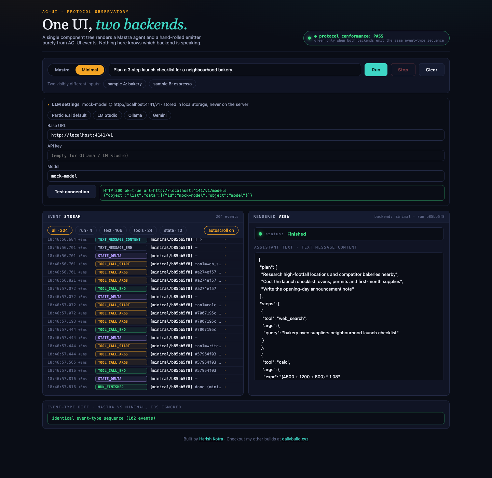
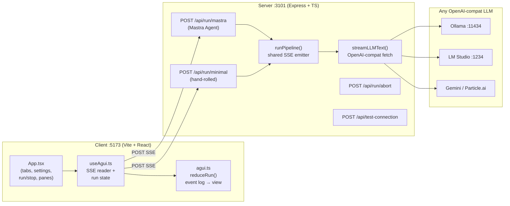

# AG-UI — One React UI, Two Backends (Mastra + Minimal)

> **Prove framework independence:** a single React client renders agent activity
> purely from [AG-UI](https://docs.ag-ui.com)-shaped events. Two different backends —
> a [Mastra](https://mastra.ai) agent and a minimal hand-rolled emitter — drive the
> **identical UI with zero client changes**. The rendered state is genuinely produced
> from the stream, never faked.

---

## Table of contents

- [Demo](#demo)
- [Tech stack](#tech-stack)
- [Architecture](#architecture)
- [Repository layout](#repository-layout)
- [Quickstart](#quickstart)
- [Configuration](#configuration)
- [The event contract](#the-event-contract)
- [How it works (code tour)](#how-it-works-code-tour)
- [Verification checklist](#verification-checklist)
- [Fork & contribute](#fork--contribute)
- [Feature ideas](#feature-ideas)
- [Troubleshooting](#troubleshooting)
- [License](#license)

## Demo



1. Pick a backend tab (**Mastra** / **Minimal**), type a task, hit **Run**.
2. The **left pane** appends raw SSE events (monospace, colour-coded by type, with
   timestamps and inter-event latency). The **right pane** renders text, tool-call
   cards, and a live state tree — all reduced from that same log.
3. Hit **Stop** mid-run: the stream ends with a genuine server `RUN_ERROR`
   (`code: "ABORTED"`), rendered in the canvas — never a spinner forever.
4. Run both backends on the same input: the **protocol conformance badge** goes
   green and the diff pane prints `identical event-type sequence (N events)`.

### Taking a screenshot without a real LLM

`scripts/mock-llm.mjs` is a stub OpenAI-compatible endpoint (streaming plan JSON,
`GET /v1/models`) purely so the UI can be demoed/photographed with no local model:

```bash
node scripts/mock-llm.mjs &          # :4141
npm run dev --workspace server       # :3101
npm run dev --workspace client       # :5173 (or :5174 if :5173 is taken)
```

Then set Base URL `http://localhost:4141/v1`, model `mock-model`, Run Mastra,
Run Minimal, screenshot. (The mock is a demo aid only — never part of the app.)

## Tech stack

| Layer | Technologies |
|---|---|
| Client | Vite 6, React 18, TypeScript 5 (strict) |
| Server | Node 26, Express 4, TypeScript 5, `@mastra/core` (`Agent`), SSE over `POST` |
| Shared | `shared/` npm workspace: AG-UI event types, LLM presets, system prompt, inference defaults |
| Protocol | AG-UI event contract over Server-Sent Events (`text/event-stream`) |
| LLM access | Any OpenAI-compatible `/v1` endpoint (Ollama, LM Studio, Gemini OpenAI-compat, Particle.ai) via `fetch` — streaming with non-streaming fallback |

No database, no auth, no ORM, no message queue — intentionally.

## Architecture



The key invariant: **both routes funnel through one `runPipeline()` function**, so
the two backends emit the identical event-type sequence (modulo ids/timestamps).
The Mastra route additionally constructs a real `Agent` (name, instructions,
model), proving a genuine framework agent can speak the same protocol as a
~50-line hand-rolled emitter.

## Repository layout

```
.
├── shared/                  # npm workspace: contract + defaults
│   ├── defaults.json        # inference defaults, presets, system prompt, event list
│   └── src/index.ts         # AguiEvent, LLMSettings, PlanDoc, DEFAULTS, PRESETS
├── server/src/
│   ├── index.ts             # Express app, Mastra Agent, routes
│   ├── pipeline.ts          # runPipeline(): the shared AG-UI emitter
│   └── llm.ts               # streamLLMText(), executeTool(), abort registry
├── client/src/
│   ├── App.tsx              # tabs, settings, run/stop, two panes, diff view
│   ├── useAgui.ts           # SSE-over-POST reader, settings, conformance check
│   ├── agui.ts              # LoggedEvent, reduceRun() reducer, diff helpers
│   └── panes.tsx            # EventLogPane, CanvasPane, SettingsPanel
└── BLOG.md                  # companion technical deep-dive
```

## Quickstart

**Prerequisites:** Node ≥ 20, plus any OpenAI-compatible LLM endpoint
(Ollama is the zero-config path: `ollama pull llama3.1 && ollama serve`).

```bash
git clone <your-fork-url> && cd <repo>
npm install
npm run build --workspace shared
npm run dev                      # server :3101 + client :5173 (concurrently)
```

Then open http://localhost:5173, keep the Ollama preset (or pick LM Studio /
Gemini / Particle.ai), press **Test connection**, and hit **Run**.

> **Port note:** the spec asked for `:3001`, but that port was already held by an
> unrelated process on the build machine, so the server defaults to `:3101`
> (`PORT` env overrides; the Vite proxy in `client/vite.config.ts` follows).

## Configuration

The Settings panel (persisted to `localStorage`, never baked into code) holds
`baseURL` / `apiKey` / `model`, with one-click presets:

```ts
// shared/defaults.json (excerpt)
"presets": {
  "particle": { "baseURL": "https://api.particle.ai/api/v1", "model": "particle-default" },
  "lmstudio": { "baseURL": "http://localhost:1234/v1",       "model": "local-model" },
  "ollama":   { "baseURL": "http://localhost:11434/v1",      "model": "llama3.1" },
  "gemini":   { "baseURL": "https://generativelanguage.googleapis.com/v1beta/openai",
                "model": "gemini-2.0-flash" }
}
```

**Test connection** performs a real `GET {baseURL}/models` server-side and shows
the true HTTP status + body — e.g. `HTTP 200 ok=true` for Ollama, or the exact
failure (`fetch failed`, `HTTP 401`, …) when the endpoint is down. No code edits
are needed to switch providers.

## The event contract

Every run streams `data: {...}\n\n` frames over `POST /api/run/:backend`:

| Event | Payload | Meaning |
|---|---|---|
| `RUN_STARTED` | `message` | run opened (includes backend/agent note) |
| `STATE_SNAPSHOT` | `snapshot` | initial `{ task, backend, plan, results }` |
| `TEXT_MESSAGE_START/CONTENT/END` | `messageId`, `delta` | real streamed token chunks |
| `TOOL_CALL_START/ARGS/END` | `toolCallId`, `toolCallName`, `argsText`, `result` | one card per planned step |
| `STATE_DELTA` | `deltaState[]` (`{op, path, value}`) | plan + per-step results |
| `RUN_FINISHED` | `message` | clean completion |
| `RUN_ERROR` | `code`, `message` | `ABORTED`, `PLAN_PARSE_ERROR`, or LLM failure |

## How it works (code tour)

**1. The Mastra backend is a real agent** (`server/src/index.ts`):

```ts
const planningAgent = new Agent({
  name: "planner",
  instructions:
    "You are a small planning agent. Return a 3-step plan then execution as strict JSON...",
  model: "openai/gpt-4o-mini" as any,
});
```

**2. Both routes share one emitter** (`server/src/pipeline.ts`) — this is what makes
the conformance claim structural rather than aspirational:

```ts
app.post("/api/run/mastra",  (req, res) => handleRun(req, res, "mastra"));
app.post("/api/run/minimal", (req, res) => handleRun(req, res, "minimal"));

send({ type: "RUN_STARTED", message: frameworkNote } as any);
send({ type: "STATE_SNAPSHOT", snapshot: { task, backend, plan: [], results: [] } } as any);
for await (const chunk of streamLLMText(settings, task, isAborted)) {
  full += chunk;
  send({ type: "TEXT_MESSAGE_CONTENT", messageId, delta: chunk } as any);
}
```

**3. The LLM prompt constrains output to JSON** (`shared/defaults.json`), and the
pipeline refuses to invent a plan when the model disobeys:

```ts
doc = JSON.parse(cleaned);   // throws on prose…
if (!doc) {
  send({ type: "STATE_DELTA",
         deltaState: [{ op: "add", path: "/parseError", value: parseError }] } as any);
  send({ type: "RUN_ERROR", code: "PLAN_PARSE_ERROR",
         message: `Model did not return valid plan JSON (${parseError})...` } as any);
  return;
}
```

**4. Cancellation is a first-class event, not a transport hack.** Stop posts the
`runId` to `/api/run/abort`; the in-flight upstream fetch is killed via
`AbortController`, and the server emits a real `RUN_ERROR … code: "ABORTED"` down
the still-open stream before closing it:

```ts
// server/src/llm.ts
const ctrl = new AbortController();
const poll = setInterval(() => { if (isAborted()) ctrl.abort(); }, 100);
```

```ts
// client/src/useAgui.ts — Stop()
await fetch("/api/run/abort", { method: "POST", body: JSON.stringify({ runId: activeRunId }) });
setTimeout(() => abortRef.current?.abort(), 800); // local backstop only
```

**5. The client is one pure reducer** (`client/src/agui.ts`): `TEXT_MESSAGE_CONTENT`
appends text, `TOOL_CALL_*` builds tool cards, `STATE_*` folds the state tree.
Conformance is a type-sequence diff ignoring ids:

```ts
export function diffSequences(a: string[], b: string[]): string[] { ... }
// → [] means green badge: "identical event-type sequence (N events)"
```

## Verification checklist

- [ ] Mastra on sample A, then Minimal on sample A → badge green, diff empty.
- [ ] Sample A vs sample B → different chunks, different tool cards.
- [ ] Stop mid-run → canvas shows `aborted` + server `ABORTED` event.
- [ ] Point Settings at Ollama → works with no code edits.
- [ ] `grep -rn "sk-\|MOCK_EVENTS\|canned" server/src client/src` → clean
      (the only "canned" hit is a comment stating plans are never canned).

## Fork & contribute

```bash
git clone <your-fork-url> && cd <repo>
npm install && npm run build --workspace shared && npm run dev
```

- Workspaces: `shared`, `server`, `client` (root has `concurrently` + TS).
- PRs welcome: keep the invariant — **any new backend must reuse `runPipeline()`**
  (or emit a byte-identical type sequence) so the conformance badge stays honest.
- Please include a curl-level verification (like the ones above) in your PR
  description showing the event stream before/after.

## Feature ideas

Good first issues if you want to extend this:

1. **Third backend** (LangChain / CrewAI / raw Vercel AI SDK) reusing `runPipeline()` —
   the badge should stay green with zero client changes.
2. **Replay mode**: persist an event log to disk and re-render it through `reduceRun()`
   without any server (time-travel debugging for agent UIs).
3. **Latency waterfall**: the log already records inter-event latency — render it as
   a timing chart to spot whether the model or the tool layer is slow.
4. **Real tool execution**: swap `executeTool()`'s toy tools for live search /
   calculator / file tools and stream their stdout as `TOOL_CALL_ARGS`.
5. **Multi-run compare**: keep N runs side-by-side and diff their rendered views,
   not just event types.
6. **WebSocket transport**: add a `ws://` variant of the stream and prove the same
   reducer handles it (protocol over transport — the whole point of AG-UI).
7. **Conformance CI**: a `scripts/verify.mjs` run that boots the server, fires both
   backends at a fixture, and fails on type-sequence divergence.

## Troubleshooting

| Symptom | Fix |
|---|---|
| `EADDRINUSE` on server start | `PORT=3102 npm run dev --workspace server`, update Vite proxy |
| `LLM request failed: fetch failed` | LLM endpoint down — check preset, `ollama serve`, then Test connection |
| `PLAN_PARSE_ERROR` | model ignored the JSON constraint — try lower temperature or a stronger model |
| Badge never green | run **both** backends on the **same** input text |

## License

MIT — fork it, break it, keep the badge green.

---

<p align="center">
  Built by <a href="https://harishkotra.me"><b>Harish Kotra</b></a> ·
  Checkout my other builds at <a href="https://dailybuild.xyz"><b>dailybuild.xyz</b></a>
</p>
